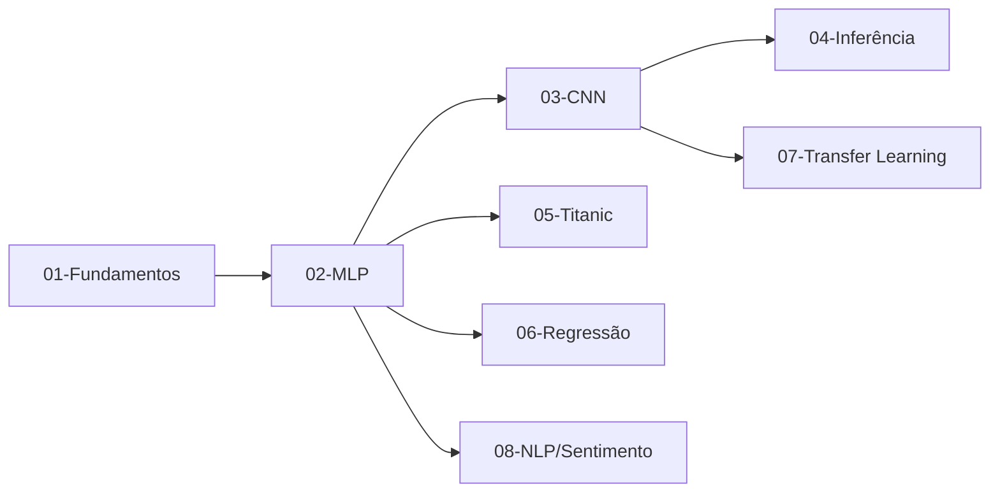

<div align="center">

# 🧠 Deep Learning Journey: From Perceptron to Transformers


<br/>


[](https://opensource.org/licenses/MIT)
[](http://makeapullrequest.com)

---

### 🎯 Um portfólio completo de Deep Learning

*Da matemática básica de um neurônio até arquiteturas modernas de Transformers e Transfer Learning*

</div>

## 📖 Sobre o Projeto

Este repositório documenta uma **jornada completa de aprendizado em Deep Learning**, partindo dos fundamentos matemáticos de um único neurônio até arquiteturas state-of-the-art como CNNs, LSTMs e Transformers. Cada módulo foi desenvolvido com foco em **compreensão profunda** e **implementação prática**, incluindo versões "from scratch" e com frameworks modernos.

### ✨ Diferenciais

- 🔍 **Implementações from scratch**: entenda a matemática por trás das redes neurais
- 🧪 **Progressão didática**: do simples ao complexo, com exemplos práticos
- 🎨 **Projetos reais**: MNIST, Titanic, previsão de preços, análise de sentimento
- 🚀 **Técnicas modernas**: Transfer Learning, LSTM, Transformers (BERT)
- 📊 **Visualizações**: gráficos de treinamento, análises exploratórias e métricas
- 💾 **Modelos persistidos**: salve e reutilize modelos treinados


## 📌 Conteúdo

<details open>
<summary><b>Navegação Rápida</b></summary>

- [📖 Sobre o Projeto](#-sobre-o-projeto)
- [📂 Estrutura dos Módulos](#-estrutura-dos-módulos)
- [🚀 Quick Start](#-quick-start)
- [▶️ Executando os Scripts](#️-executando-os-scripts)
- [📊 Resultados e Métricas](#-resultados-e-métricas)
- [🧩 Modelos Treinados](#-modelos-treinados)
- [🛠️ Tecnologias Utilizadas](#️-tecnologias-utilizadas)
- [📚 Aprendizados](#-aprendizados)
- [🤝 Contribuindo](#-contribuindo)
- [👤 Autor](#-autor)

</details>

---

## 📂 Estrutura dos Módulos

O projeto está organizado em **8 módulos progressivos**, cada um explorando diferentes aspectos do Deep Learning:

<table>
<tr>
<td width="50%">

### 🟢 Módulos Fundamentais

#### 01 - Fundamentos do Perceptron
**Objetivo:** Compreender a matemática básica  
**Técnicas:**
- Neurônio artificial from scratch
- Função de ativação (step function)
- Pesos, bias e forward propagation
- Portas lógicas (AND, OR)

**Arquivos:**
- [`neuronio_simples.py`](01-fundamentos-perceptron/neuronio_simples.py)
- [`neuronio_que_aprende.py`](01-fundamentos-perceptron/neuronio_que_aprende.py)

---

#### 02 - Multi-Layer Perceptron (MLP)
**Objetivo:** Resolver problemas não-lineares  
**Técnicas:**
- Backpropagation from scratch
- XOR problem (clássico)
- Classificação multiclasse (Iris dataset)
- Comparação: Python puro vs Keras

**Arquivos:**
- [`rede_xor_pura.py`](02-mpl-classificacao/rede_xor_pura.py)
- [`rede_xor_keras.py`](02-mpl-classificacao/rede_xor_keras.py)
- [`rede_iris.py`](02-mpl-classificacao/rede_iris.py)

---

#### 03 - Convolutional Neural Networks (CNN)
**Objetivo:** Visão computacional  
**Técnicas:**
- Conv2D layers e pooling
- Feature extraction automática
- MNIST digit recognition
- Comparação MLP vs CNN

**Arquivos:**
- [`rede_mnist_mpl.py`](03-cnn-visao-computacional/rede_mnist_mpl.py)
- [`rede_mnist_cnn.py`](03-cnn-visao-computacional/rede_mnist_cnn.py)

---

#### 04 - Modelo em Produção
**Objetivo:** Deploy e inferência  
**Técnicas:**
- Carregar modelos treinados (.keras)
- Fazer predições em novos dados
- Pipeline de inferência

**Arquivos:**
- [`usar_ia.py`](04-app-inferencia/usar_ia.py)

</td>
<td width="50%">

### 🔵 Módulos Avançados

#### 05 - Data Science: Titanic
**Objetivo:** Análise exploratória + predição  
**Técnicas:**
- EDA (Exploratory Data Analysis)
- Feature engineering
- Tratamento de missing values
- Classificação binária (survival)

**Arquivos:**
- [`titanic_analise.py`](05-data-science-titanic/titanic_analise.py)

---

#### 06 - Regressão: Preços de Casas
**Objetivo:** Predição de valores contínuos  
**Técnicas:**
- MLP para regressão
- Normalização de features
- Métricas: MAE, MSE, RMSE
- Boston Housing dataset

**Arquivos:**
- [`prever_precos.py`](06-regressao-casas/prever_precos.py)

---

#### 07 - Transfer Learning
**Objetivo:** Reaproveitar modelos pré-treinados  
**Técnicas:**
- VGG16 (ImageNet weights)
- Fine-tuning
- Data augmentation
- Cats vs Dogs classification

**Arquivos:**
- [`gatos_vs_caes.py`](07-transfer-learning/gatos_vs_caes.py)

---

#### 08 - NLP: Análise de Sentimento
**Objetivo:** Processamento de linguagem natural  
**Técnicas:**
- LSTM para sequências de texto
- Word embeddings
- IMDB reviews dataset
- **Bônus:** Transformers (BERT/Hugging Face)

**Arquivos:**
- [`analise_sentimento.py`](08-nlp-sentimento/analise_sentimento.py)
- [`bonus_transformer.py`](08-nlp-sentimento/bonus_transformer.py)

</td>
</tr>
</table>

---


## 🚀 Quick Start

### Pré-requisitos

- **Python 3.10+** (recomendado 3.10-3.12 para compatibilidade com TensorFlow)
- **pip** (gerenciador de pacotes)
- **git** (para clonar o repositório)
- *Opcional:* GPU com suporte CUDA para treinamento acelerado

### Instalação

#### 1️⃣ Clone o repositório

```bash
git clone https://github.com/Viniirb/neural-networks-from-scratch.git
cd neural-networks-from-scratch
```

#### 2️⃣ Crie um ambiente virtual

<details>
<summary><b>🪟 Windows</b></summary>

```powershell
# PowerShell
python -m venv .venv
.\.venv\Scripts\Activate.ps1
```

```bat
:: CMD
python -m venv .venv
.\.venv\Scripts\activate
```

</details>

<details>
<summary><b>🐧 Linux / 🍎 macOS</b></summary>

```bash
python3 -m venv .venv
source .venv/bin/activate
```

</details>

#### 3️⃣ Instale as dependências

```bash
pip install --upgrade pip
pip install -r requirements.txt
```

<details>
<summary>📦 <b>Principais pacotes instalados</b></summary>

- `tensorflow` / `keras` - Framework de deep learning
- `numpy` - Computação numérica
- `pandas` - Manipulação de dados
- `matplotlib` / `seaborn` - Visualização
- `scikit-learn` - ML utils e datasets
- `opencv-python` - Processamento de imagens
- `transformers` - Hugging Face (Transformers/BERT)

</details>

> ⚠️ **Nota sobre TensorFlow:** Se encontrar erros com Python 3.13+, considere usar Python 3.10-3.12. Consulte a [documentação oficial](https://www.tensorflow.org/install).

---


## ▶️ Executando os Scripts

Cada módulo pode ser executado independentemente. Navegue até a pasta e execute os scripts:

### 🎯 Recomendação de Ordem



### 📜 Comandos por Módulo

<table>
<tr>
<td>

**Módulo 01 - Fundamentos**
```bash
python 01-fundamentos-perceptron/neuronio_simples.py
python 01-fundamentos-perceptron/neuronio_que_aprende.py
```

</td>
<td>

**Módulo 02 - MLP**
```bash
python 02-mpl-classificacao/rede_xor_pura.py
python 02-mpl-classificacao/rede_xor_keras.py
python 02-mpl-classificacao/rede_iris.py
```

</td>
</tr>

<tr>
<td>

**Módulo 03 - CNN**
```bash
python 03-cnn-visao-computacional/rede_mnist_mpl.py
python 03-cnn-visao-computacional/rede_mnist_cnn.py
```

</td>
<td>

**Módulo 04 - Inferência**
```bash
python 04-app-inferencia/usar_ia.py
```

</td>
</tr>

<tr>
<td>

**Módulo 05 - Data Science**
```bash
python 05-data-science-titanic/titanic_analise.py
```

</td>
<td>

**Módulo 06 - Regressão**
```bash
python 06-regressao-casas/prever_precos.py
```

</td>
</tr>

<tr>
<td>

**Módulo 07 - Transfer Learning**
```bash
python 07-transfer-learning/gatos_vs_caes.py
```
*⏱️ Pode demorar: download de dataset + treinamento*

</td>
<td>

**Módulo 08 - NLP**
```bash
python 08-nlp-sentimento/analise_sentimento.py
python 08-nlp-sentimento/bonus_transformer.py
```
*🤗 Transformer requer Hugging Face Transformers*

</td>
</tr>
</table>

---


## 📊 Resultados e Métricas

### 🎯 Performance dos Modelos

<div align="center">

| 🏆 Modelo | 🔧 Arquitetura | 📚 Dataset | 🎯 Métrica Principal | ⚡ Performance |
|:---|:---|:---|:---|:---:|
| **Perceptron** | 1 neurônio | Portas Lógicas (AND/OR) | Acurácia | **100%** ✅ |
| **MLP (XOR)** | 2-2-1 (from scratch) | XOR Problem | Acurácia | **100%** ✅ |
| **MLP (Iris)** | Dense layers | Iris (150 samples) | Acurácia | **~96%** ✅ |
| **MLP (MNIST)** | Dense layers | MNIST Digits | Acurácia | **~97%** ⭐ |
| **CNN (MNIST)** | Conv2D + Pooling | MNIST Digits | Acurácia | **~99%** 🚀 |
| **MLP (Titanic)** | Dense layers | Titanic (891 samples) | Acurácia | **~80%** ⭐ |
| **MLP (Regressão)** | Dense layers | Boston Housing | MAE | **Variável** 📊 |
| **Transfer Learning** | VGG16 (fine-tuned) | Cats vs Dogs | Acurácia | **~92%** 🚀 |
| **LSTM (IMDB)** | Embedding + LSTM | IMDB Reviews (25k) | Acurácia | **~87%** ⭐ |
| **Transformer (BERT)** | Hugging Face Pipeline | English Texts | Confidence | **>90%** 🔥 |

</div>

> 📌 **Nota:** Os valores podem variar dependendo de seed aleatória, hiperparâmetros, número de épocas e configuração do ambiente.

### 📈 Comparações Interessantes

<details>
<summary><b>🆚 MLP vs CNN no MNIST</b></summary>

- **MLP:** ~97% de acurácia, mas sensível ao posicionamento dos dígitos
- **CNN:** ~99% de acurácia, invariante a translações (pooling + convolução)
- **Parâmetros:** CNN tem menos parâmetros por usar shared weights
- **Treinamento:** CNN converge mais rápido e generaliza melhor

</details>

<details>
<summary><b>🆚 LSTM vs Transformer (NLP)</b></summary>

- **LSTM:** Treinada do zero, boa para sequences pequenas/médias
- **Transformer (BERT):** Pré-treinado, zero-shot learning, state-of-the-art
- **Tempo:** LSTM requer treinamento (~10-30min), Transformer usa modelo pronto
- **Performance:** Transformer superior em praticamente todos os benchmarks

</details>

---


## 🧩 Modelos Treinados

Os modelos treinados estão salvos no formato `.keras` (Keras 3.x) e podem ser carregados para inferência:

```python
from keras.models import load_model

# Carregar modelo
model = load_model('models/mnist_cnn_model.keras')

# Fazer predições
predictions = model.predict(new_data)
```

### 📦 Modelos Disponíveis

- [`models/mnist_cnn_model.keras`](models/mnist_cnn_model.keras) - CNN treinada no MNIST (~99% acc)
- Outros modelos podem ser gerados executando os scripts de treinamento

> 💾 **Nota:** Modelos grandes (>10MB) e datasets estão no `.gitignore` para não sobrecarregar o repositório.

---

## 🛠️ Tecnologias Utilizadas

<div align="center">

### Core Frameworks

[](https://www.tensorflow.org/)
[](https://keras.io/)
[](https://pytorch.org/)
[](https://huggingface.co/)

### Data Science & ML

[](https://numpy.org/)
[](https://pandas.pydata.org/)
[](https://scikit-learn.org/)
[](https://matplotlib.org/)
[](https://seaborn.pydata.org/)

### Computer Vision

[](https://opencv.org/)
[](https://python-pillow.org/)

### Development

[](https://www.python.org/)
[](https://jupyter.org/)
[](https://code.visualstudio.com/)
[](https://git-scm.com/)

</div>

---

## 📚 Aprendizados

Durante este projeto, foram explorados diversos conceitos fundamentais e avançados:

### 🧠 Conceitos Teóricos

- ✅ Neurônio artificial e função de ativação
- ✅ Forward propagation e backpropagation
- ✅ Gradiente descendente e otimizadores (SGD, Adam)
- ✅ Overfitting, underfitting e regularização
- ✅ Batch normalization e dropout
- ✅ Convolutional layers e pooling
- ✅ Recurrent Neural Networks (LSTM/GRU)
- ✅ Transfer Learning e fine-tuning
- ✅ Word embeddings e attention mechanism

### 💡 Práticas de Engenharia

- ✅ Pré-processamento de dados (normalização, encoding)
- ✅ Data augmentation para imagens
- ✅ Train/validation/test split
- ✅ Callbacks (EarlyStopping, ModelCheckpoint)
- ✅ Métricas de avaliação (accuracy, precision, recall, MAE, etc.)
- ✅ Visualização de resultados (loss curves, confusion matrix)
- ✅ Salvamento e carregamento de modelos
- ✅ Integração com bibliotecas modernas (Hugging Face)

---

## 🤝 Contribuindo

Contribuições são bem-vindas! Se você encontrou um bug, tem uma sugestão ou quer adicionar um novo exemplo:

1. Fork este repositório
2. Crie uma branch para sua feature (`git checkout -b feature/NovoModulo`)
3. Commit suas mudanças (`git commit -m 'Adiciona novo módulo de GAN'`)
4. Push para a branch (`git push origin feature/NovoModulo`)
5. Abra um Pull Request

### 💡 Ideias para Contribuir

- 🎨 Adicionar GAN (Generative Adversarial Networks)
- 🗣️ Expandir NLP com mais modelos (GPT, T5)
- 🎵 Adicionar RNN para geração de música
- 🎮 Reinforcement Learning (DQN, A3C)
- 📊 Dashboard interativo com Streamlit
- 🐳 Dockerização do projeto

---


## 👤 Autor

<div align="center">


### Vinicius Rolim Barbosa

*Software Engineer | Deep Learning Enthusiast | AI Researcher*

[](https://github.com/Viniirb)
[](https://linkedin.com/in/vinicius-rolim)
[](mailto:vinicius@example.com)

---

### 📬 Contato

💬 Dúvidas ou sugestões? Abra uma [issue](https://github.com/Viniirb/neural-networks-from-scratch/issues) no repositório!

---

### ⭐ Se este projeto te ajudou, considere dar uma estrela!

<sub>Feito com 💙 e muitas horas de estudo</sub>

</div>

---

<div align="center">

### 📄 Licença

Este projeto está sob a licença MIT. Veja o arquivo [LICENSE](LICENSE) para mais detalhes.

**© 2024-2026 Vinicius Rolim Barbosa** | [github.com/Viniirb](https://github.com/Viniirb)

</div>


