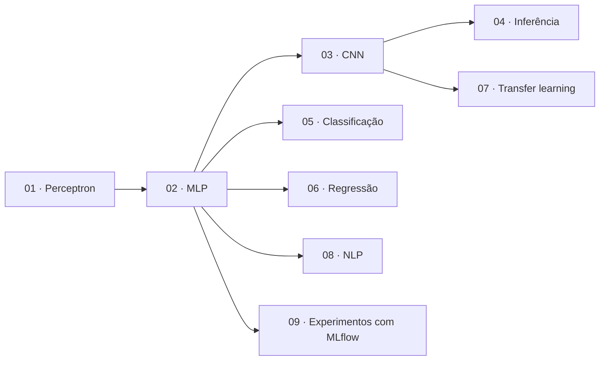

<div align="center">

# Deep Learning Journey

### Do perceptron a CNNs, LSTMs e Transformers com exemplos práticos em Python

[](https://www.python.org/)
[](https://www.tensorflow.org/)
[](LICENSE)
[](https://github.com/Viniirb/neural-networks-from-scratch/actions/workflows/python-smoke.yml)
[](CONTRIBUTING.md)

Um laboratório educacional, em português, que conecta fundamentos matemáticos,
implementações *from scratch* e aplicações com frameworks modernos.

[Começar](#começo-rápido) · [Explorar os módulos](#trilha-de-aprendizado) · [Contribuir](CONTRIBUTING.md) · [Roadmap](ROADMAP.md)

</div>

## Por que este projeto existe?

Materiais de deep learning frequentemente começam em APIs de alto nível sem
mostrar o que acontece por baixo, ou explicam a matemática sem chegar a um
programa executável. Este repositório aproxima essas duas perspectivas:

- implementações pequenas para compreender pesos, bias, ativações e gradientes;
- comparações entre código manual e bibliotecas como TensorFlow/Keras;
- exemplos progressivos de classificação, regressão, visão computacional e NLP;
- scripts independentes que podem ser estudados e modificados por módulo;
- conteúdo e instruções voltados à comunidade de língua portuguesa.

O projeto é educacional e está em evolução. Ele não oferece modelos prontos para
uso em produção nem substitui validação científica, revisão de segurança ou
avaliação de viés para aplicações reais.

## Trilha de aprendizado

| Módulo | Tema | O que você pratica | Implementação principal |
| --- | --- | --- | --- |
| [`01`](01-fundamentos-perceptron) | Perceptron | neurônio, pesos, bias e função degrau | Python e NumPy |
| [`02`](02-mpl-classificacao) | MLP e classificação | XOR, backpropagation e Iris | do zero e Keras |
| [`03`](03-cnn-visao-computacional) | Visão computacional | MLP versus CNN no MNIST | TensorFlow/Keras |
| [`04`](04-app-inferencia) | Inferência | carregamento de modelo e predição | Keras |
| [`05`](05-data-science-titanic) | Data science | exploração, preparação e classificação | Pandas e Keras |
| [`06`](06-regressao-casas) | Regressão | normalização e previsão de valores | scikit-learn e Keras |
| [`07`](07-transfer-learning) | Transfer learning | VGG16, data augmentation e fine-tuning | TensorFlow/Keras |
| [`08`](08-nlp-sentimento) | NLP | sentimento com LSTM e Transformers | Keras e Hugging Face |
| [`09`](09-deep-mlp-parkinson) | Experimentação | comparação de MLPs e rastreamento | Keras e MLflow |


```mermaid
flowchart LR
    A[01 · Perceptron] --> B[02 · MLP]
    B --> C[03 · CNN]
    C --> D[04 · Inferência]
    B --> E[05 · Classificação]
    B --> F[06 · Regressão]
    C --> G[07 · Transfer learning]
    B --> H[08 · NLP]
    B --> I[09 · Experimentos com MLflow]
```

Você não precisa executar tudo em sequência. Os módulos `01` e `02` formam a
base conceitual; depois deles, escolha a trilha mais relevante para seu estudo.

## Começo rápido

### Pré-requisitos

- Python 3.10, 3.11 ou 3.12;
- Git e `pip`;
- ambiente virtual recomendado;
- GPU opcional — os exemplos introdutórios funcionam em CPU.

> TensorFlow e algumas bibliotecas podem ainda não oferecer suporte imediato às
> versões mais recentes do Python. Python 3.11 é a opção mais conservadora para
> reproduzir todo o ambiente atual.

### Instalação

```bash
git clone https://github.com/Viniirb/neural-networks-from-scratch.git
cd neural-networks-from-scratch
python -m venv .venv
```

Ative o ambiente:

```powershell
# Windows PowerShell
.\.venv\Scripts\Activate.ps1
```

```bash
# Linux ou macOS
source .venv/bin/activate
```

Instale as dependências:

```bash
python -m pip install --upgrade pip
python -m pip install -r requirements.txt
```

O `requirements.txt` representa o ambiente completo usado nos experimentos e é
volumoso. A separação de dependências por módulo está prevista no
[roadmap](ROADMAP.md). Para os primeiros conceitos, comece pelos scripts que
usam apenas Python ou NumPy.

## Executando os exemplos

Execute os comandos a partir da raiz do repositório:

```bash
# Perceptron e portas lógicas
python 01-fundamentos-perceptron/neuronio_simples.py
python 01-fundamentos-perceptron/neuronio_que_aprende.py

# XOR e classificação Iris
python 02-mpl-classificacao/rede_xor_pura.py
python 02-mpl-classificacao/rede_xor_keras.py
python 02-mpl-classificacao/rede_iris.py

# MNIST com MLP e CNN
python 03-cnn-visao-computacional/rede_mnist_mpl.py
python 03-cnn-visao-computacional/rede_mnist_cnn.py

# Inferência com modelo salvo
python 04-app-inferencia/usar_ia.py

# Classificação e regressão tabular
python 05-data-science-titanic/titanic_analise.py
python 06-regressao-casas/prever_precos.py

# Transfer learning e NLP
python 07-transfer-learning/gatos_vs_caes.py
python 08-nlp-sentimento/analise_sentimento.py
python 08-nlp-sentimento/bonus_transformer.py

# Experimentos rastreados com MLflow
python 09-deep-mlp-parkinson/train_experiments.py
```

Alguns módulos baixam datasets ou modelos na primeira execução e podem consumir
tempo, memória e rede. Consulte o código do módulo antes de executá-lo em um
ambiente com recursos limitados.

## Dados, modelos e reprodutibilidade

- Datasets grandes e artefatos de treinamento não são versionados no Git.
- O modelo demonstrativo [`models/mnist_cnn_model.keras`](models/mnist_cnn_model.keras)
  é mantido para o exemplo de inferência.
- Métricas podem variar conforme seed, hardware, versão das bibliotecas,
  hiperparâmetros e divisão dos dados.
- Novas contribuições devem informar a origem e a licença de cada dataset.
- Resultados deste repositório são didáticos e não representam benchmarks
  independentes ou garantias de desempenho.

Para verificar rapidamente a sintaxe de todos os exemplos:

```bash
python -m compileall -q .
```

O mesmo comando é executado pelo workflow
[`Python smoke check`](.github/workflows/python-smoke.yml) em pushes e pull
requests para `main`.

## Estrutura do repositório

```text
.
├── 01-fundamentos-perceptron/
├── 02-mpl-classificacao/
├── 03-cnn-visao-computacional/
├── 04-app-inferencia/
├── 05-data-science-titanic/
├── 06-regressao-casas/
├── 07-transfer-learning/
├── 08-nlp-sentimento/
├── 09-deep-mlp-parkinson/
├── models/
├── .github/
├── requirements.txt
└── README.md
```

## Como contribuir

Contribuições são bem-vindas, especialmente para:

- corrigir explicações, exemplos e problemas de reprodução;
- adicionar testes rápidos para as implementações matemáticas;
- documentar origem e licença dos datasets;
- reduzir e separar dependências por módulo;
- oferecer alternativas executáveis em CPU;
- traduzir partes essenciais para inglês sem remover o foco em português.

Leia o [guia de contribuição](CONTRIBUTING.md), consulte o
[roadmap](ROADMAP.md) e abra uma issue antes de implementar uma mudança extensa.
Ao participar, siga o [Código de Conduta](CODE_OF_CONDUCT.md). Vulnerabilidades
devem ser comunicadas conforme a [política de segurança](SECURITY.md).

## Status do projeto

Este é um projeto open source em estágio inicial. A API pública e a organização
dos módulos ainda podem mudar. Não há, neste momento, uma promessa de
compatibilidade entre releases.

Marcos planejados:

- testes automatizados para os módulos fundamentais;
- dependências menores e específicas por trilha;
- documentação verificável de datasets e resultados;
- primeira release versionada do conteúdo educacional.

Veja o [ROADMAP.md](ROADMAP.md) para detalhes.

## Autor

Criado e mantido por **Vinicius Rolim Barbosa**.

- GitHub: [@Viniirb](https://github.com/Viniirb)
- LinkedIn: [vinicius-rolim](https://www.linkedin.com/in/vinicius-rolim)

## Licença

Distribuído sob a licença MIT. Consulte o arquivo [LICENSE](LICENSE).
